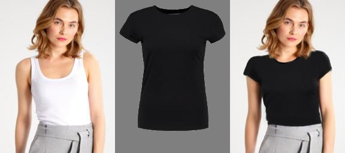

# Data Science Thesis 2021

This repository pertains to the **Data Science Thesis** of Adam Horvath-Reparszky at University of Amsterdam in 2021.

**Link to the paper** : https://www.overleaf.com/project/6071a080ced8b32b96aa5101

**Author**: Adam Horvath-Reparszky

* **Student-ID**: 13326481

* **Email**: adam.horvath-reparszky@student.uva.nl

**Internal Supervisior**: Dr. Shaodi You

* **Email**: s.you@uva.nl

**Company Supervisor**: Hernani Costa

* **Email**: hernani@lalaland.ai

## Thesis Schedule
| Week  | Date | Planned Achievement  | Achieved |
| ------------- | ------------- | ------------- | ------------- |
| Week 1 | 29/03 - 04/04 | Examine research papers in the field of garment transferring | Almost 20-25 related research papers, 5 of them have been selected as most related papers ( I will focus on these implementations) |
| Week 2 (Current) | 05/04 - 11/04  | Start to do experiments using the selected papers. Decide which dataset I am going to use | I decided to use the VITON dataset, beacuse it is public and most used benchmark dataset. Experiments on Parser-Free, CP_VITON+ and ACGPN implementation |
| Week 3 |  12/04 - 18/04 | Finish experiments and start to identify general problems and categorise them. Select the evaluation measures |  |
| Week 4  | 19/04 - 25/04 | Test the evaluation measures. Start writing the Abstartct/Introduction/Related Work part in the Thesis draft |  |
| Week 5 |  26/04 - 02/05 | Writing the Thesis draft (Abstract/Intro/Literature review). Get new ideas how to solve existing problems (artifacts) |  |
| Week 6  |  03/05 - 09/05 | Try out solutions for solving problems. Improve the Thesis draft|  |
| Week 7 | 10/05 - 16/05 | Try out solutions for solving problems. Improve the Thesis Draft |  |
| Week 8  | 17/05 - 23/05 | Writing Methodology + Results |  |
| Week 9 | 24/05 - 30/05 | Writing Methodology + Results|  |
| Week 10  | 31/05 - 06/06 | Evaluation part |  |
| Week 11 | 07/06 - 13/0607/06 - 13/06 | Finalise the Methodology part + Future work|  |
| Week 12  | 14/06 - 20/06 | Final version of Thesis Draft |  |
| Week 13 | 21/06 - 27/06 | Finishing the thesis and prepare for Thesis Defense |  |

## Most related research papers
| Name of the paper  | Link to paper | Link to code |
| ------------- | ------------- | ------------- |
| Parser-Free Virtual Try-on via Distilling Appearance Flows| https://arxiv.org/pdf/2103.04559v2.pdf | https://github.com/geyuying/PF-AFN |
|VITON-HD: High-Resolution Virtual Try-On via Misalignment-Aware Normalization| https://arxiv.org/pdf/2103.16874v1.pdf| Not available|
|VOGUE: Try-On by StyleGAN Interpolation Optimization| https://vogue-try-on.github.io/| Not available |
|Towards Photo-Realistic Virtual Try-On by Adaptively Generating↔Preserving Image Content|https://openaccess.thecvf.com/content_CVPR_2020/papers/Yang_Towards_Photo-Realistic_Virtual_Try-On_by_Adaptively_Generating-Preserving_Image_Content_CVPR_2020_paper.pdf|https://github.com/switchablenorms/DeepFashion_Try_On|
|CP-VTON+: Clothing Shape and Texture Preserving Image-Based Virtual Try-On| https://minar09.github.io/cpvtonplus/cvprw20_cpvtonplus.pdf| https://github.com/minar09/cp-vton-plus|
|Disentangled Cycle Consistency for Highly-realistic Virtual Try-On|https://arxiv.org/pdf/2103.09479.pdf| https://github.com/ChongjianGE/DCTON|
|Do Not Mask What You Do Not Need to Mask: a Parser-Free Virtual Try-On(WUTON)|https://arxiv.org/pdf/2007.02721.pdf| Not available|
|Image Based Virtual Try-on Network from unpaired data - Amazon research|https://assets.amazon.science/1a/2b/7a4dd8264ce19a959559da799aff/scipub-1281.pdf| Not available|
|Style and Pose Control for Image Synthesis of Humans from a Single Monocular View|https://arxiv.org/pdf/2102.11263.pdf| Not available|

## Experiments examples by paper
* Parser-Free Virtual Try-on via Distilling Appearance Flows

  
  
  

* Towards Photo-Realistic Virtual Try-On by Adaptively Generating↔Preserving Image Content

  
  

  
  

* CP-VTON+: Clothing Shape and Texture Preserving Image-Based Virtual Try-On

  
  
  

  
  

## Dataset

VITON contains a training set of 14,221 image pairs and a test set of 2,032 image pairs, each of which has a front-view woman photo and a top clothing image with the resolution 256 x 192. All the different approaches are trained and tested on this dataset.

## Qualitative Evaluation

This thesis mainly perform visual comparison of my method with recent proposed parser-based methods including VITON, Parser-free implementation, CPVTON+ and ACGPN.

I will use a classification, published by ACGPN implementation on VITON test data to get three different image pools categorised by difficulty (easy, medium, difficult).

## Quantitative Evaluation

* **Frechet Inception Distance (FID)** : is a metric used to assess the quality of images created by the generator of a generative adversarial network (GAN). Unlike the earlier inception score (IS), which evaluates only the distribution of generated images, the FID compares the distribution of generated images with the distribution of real images that were used to train the generator.
  * https://machinelearningmastery.com/how-to-implement-the-frechet-inception-distance-fid-from-scratch/
  * https://jonathan-hui.medium.com/gan-how-to-measure-gan-performance-64b988c47732
  * https://www.coursera.org/lecture/build-better-generative-adversarial-networks-gans/frechet-inception-distance-fid-LY8WK
  * https://github.com/mseitzer/pytorch-fid

* **Structural similarity (SSIM)** :  is a method for predicting the perceived quality of digital television and cinematic pictures, as well as other kinds of digital images and videos. SSIM is used for measuring the similarity between two images. The SSIM index is a full reference metric; in other words, the measurement or prediction of image quality is based on an initial uncompressed or distortion-free image as reference.
  * https://medium.com/srm-mic/all-about-structural-similarity-index-ssim-theory-code-in-pytorch-6551b455541e

